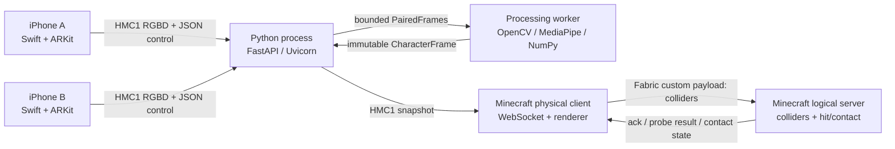

# Project context and system architecture

## 1. What is being built

The system turns one real person into two aligned representations bound to a Minecraft player:

- **Appearance:** a colored point cloud reconstructed from measured RGB and depth.
- **Interaction:** named anatomical landmarks and analytic colliders for body parts, especially hands and feet. Minecraft's normal player entity continues to own locomotion, health, inventory, gravity, collision, damage, and respawn.

Minecraft displays the appearance while its logical server evaluates the interaction geometry. Both must come from the exact same immutable `CharacterFrame`; mixing a cloud from one capture with colliders from another is a correctness failure.

This repository currently contains design documentation only. Every class, package, endpoint, and directory described below is a target architecture until its code is added.

## 2. Scope

The first demo supports one subject, exactly two capture devices, one backend process, and one Minecraft client with its integrated server. The subject holds a pose while the backend selects a close frame pair. Recapture atomically replaces the old snapshot.

In scope:

- Real ARKit RGB and LiDAR depth.
- Saved input fixtures and deterministic replay.
- Two-camera calibration into one metric stage frame.
- Person masking, body and hand landmarks, point-cloud reconstruction, and analytic colliders.
- Minecraft point rendering, collider debug rendering, server-authoritative ray hits, and hand/foot contact with one full cube.
- Local, rate-limited diagnostics at service boundaries.

Out of scope for the MVP: tracked gestures as movement inputs, finger physics, physical limb push-out, general multiplayer distribution, mesh reconstruction, and fabricated geometry for occluded surfaces.

## 3. Runtime topology and ownership



| Component | Owns | Must not own |
|---|---|---|
| iOS capture app | AR session, pixel buffers, device/session identity, frame sequence, monotonic timestamps, encoding, bounded upload | Calibration truth, pose inference, canonical point cloud |
| FastAPI I/O layer | WebSockets, framing validation, device connections, clock probes, bounded queues, health, subscriber publication | CPU-heavy vision on the event loop |
| Processing worker | Pair selection, calibration, detection calls, reconstruction, fitting, immutable frame assembly | Socket lifetime, Minecraft state |
| Vision/collider module | Person mask, body/hands observations, 3D registration, provenance, validity, collider fitting | Frame pairing or publishing a partial character |
| Minecraft physical client | Backend socket, decoding, player-local normalization, GPU buffers, input intent, debug UI | Authoritative movement or damage |
| Minecraft logical server | Player binding, internal player lifecycle, normal movement physics, anatomical combat/contact state | Receiving RGB/depth or rendering the cloud |

## 4. End-to-end data flow

1. A phone starts a new UUID `session_id`, connects to `/ws/capture`, and sends `client_hello`.
2. The backend accepts only configured device IDs and sends periodic `clock_ping` messages.
3. Each phone replies with phone-clock receive/send timestamps. The backend estimates offset and uncertainty.
4. On `capture_request`, each phone copies one synchronized `ARFrame`'s color, scene depth, confidence, intrinsics, camera pose, and metadata, then emits an `HMC1/RGBD` message.
5. The backend validates the envelope before allocating, validates the header against payload ranges, records the raw packet, and inserts it into that device/session's queue. Capacity is two; newest data replaces an unprocessed old frame.
6. The pairer normalizes timestamps, selects different-device frames within the skew budget, and emits `PairedFrames` exactly once.
7. Vision detects one person, body landmarks, and up to two hands per view. Reconstruction masks/unprojects each view using its calibration, then merges and downsamples the points.
8. Landmark registration and collider fitting return validity-aware geometry. The assembler creates the next monotonically increasing `CharacterFrame.frame_id` only when cloud and interaction data refer to the same source pair and calibration.
9. The publisher serializes one `HMC1/CHARACTER_FRAME` message and sends it to each `/ws/character` subscriber. A slow subscriber retains only the latest unsent snapshot.
10. The Minecraft client validates and decodes the snapshot off the render thread. A clean upright capture locks a uniform `1.8 / measured_height_m` scale and a player-local root shared by points, landmarks, and colliders.
11. The server validates and accepts the collider state, then returns a snapshot acknowledgement. Only that acknowledged ID becomes active for both rendered geometry and interaction.
12. Movement and attack payloads contain intent only. The logical server derives player motion, eye ray, reach, block obstruction, and nearest anatomical/ordinary hit.

## 5. Coordinate systems

### Stage frame

- Unit: meter.
- Origin: floor at the marked center of the capture area.
- `+Y`: up.
- `+X`: image-right when viewed from the designated front camera.
- `+Z`: toward the designated front camera.
- Transform names are `T_destination_from_source`.
- Matrices are 4×4, row-major on the wire, and applied to column vectors: `p_destination = T_destination_from_source × [x,y,z,1]`.
- Anatomical left/right always means the subject's left/right.

### Optical frame

- `+X`: image-right.
- `+Y`: image-down.
- `+Z`: forward from the camera.
- A depth sample is optical `Z`, so `p_optical = z * inverse(K_depth) * [u,v,1]`.
- ARKit camera axes are not silently treated as OpenCV optical axes. A named, tested conversion precedes `T_stage_from_optical`.

### Minecraft frame

- `+X`, `+Y`, and `+Z` stage axes map to the same Minecraft axes.
- `p_world_blocks = anchor_blocks + blocks_per_meter * p_stage_meters`.
- Default `blocks_per_meter = 1.0`.
- The same mapping is applied to cloud positions, landmarks, collider centers/endpoints/axes/sizes, and hit points. Radius and half-extents are multiplied by the scale but never translated.

## 6. State and concurrency model

The backend runs as **one Uvicorn worker** for the MVP because device connections, calibration, queues, and subscribers are in memory. Starting `--workers 2` would split phones and Minecraft subscribers across unrelated processes.

The process has these long-lived owners:

| Owner | Mutable state | Concurrency rule |
|---|---|---|
| `ConnectionRegistry` | capture and character sockets | touched on FastAPI event loop only |
| `SessionRegistry` | active device sessions and last sequences | event loop only; reject older/replayed sequences |
| `ClockEstimator` | bounded probe samples per session | event loop only |
| `FrameQueues` | queue of at most two decoded frames/device | async queue; newest replaces oldest when full |
| `CharacterProcessor` | MediaPipe task instances and subject dimensions | one dedicated worker thread; no concurrent model calls |
| `SnapshotStore` | latest immutable `CharacterFrame` | atomic reference replacement after full validation |
| `CharacterHub` | subscriber send queues of size one | event loop only; latest snapshot wins |

The Minecraft client similarly keeps an `AtomicReference<DecodedCharacterFrame>` for the network result. Render-thread code consumes a completed value; it never sees a partially filled list. The logical server owns a different immutable `ActiveColliderSnapshot` installed on its server thread after validation.

## 7. Proposed repository layout

```text
.
├── README.md
├── docs/
├── contracts/
│   ├── schemas/                 # JSON Schema generated/checked from contract models
│   ├── fixtures/                # golden .hmc packets + expected decoded JSON
│   └── landmark_names.json      # canonical model-index/name mapping
├── ios-capture/
│   └── HumansCapture.xcodeproj
├── backend/
│   ├── pyproject.toml
│   ├── uv.lock
│   ├── models/                  # pinned .task files + checksums, or fetch script
│   ├── src/hmc_backend/
│   │   ├── api/                 # FastAPI routes and socket registries
│   │   ├── contracts/           # Pydantic transport/internal models
│   │   ├── protocol/            # HMC1 framing and buffer decoding
│   │   ├── capture/             # pairing, clock sync, recording/replay
│   │   ├── calibration/
│   │   ├── reconstruction/
│   │   ├── vision/
│   │   ├── colliders/
│   │   ├── pipeline.py
│   │   └── main.py
│   └── tests/
├── minecraft-mod/
│   ├── gradle.properties
│   ├── build.gradle
│   └── src/
│       ├── main/java/dev/hmc/   # common DTOs, payloads, logical-server queries
│       └── client/java/dev/hmc/ # backend socket, decode, renderer, keybinds
└── scripts/                     # fixture generation and end-to-end helpers
```

`contracts/fixtures` is the interoperability gate. Swift, Python, and Java must decode the same golden packets, and each encoder must produce bytes accepted by the other two decoders.

## 8. Failure semantics

- Malformed text control: reply with `error`, then close with WebSocket policy error if the violation affects session trust.
- Invalid binary envelope or declared size above limit: close immediately; do not attempt recovery within that binary message.
- Old/repeated sequence: reject and log; do not rewind a session.
- Missing depth, calibration, or required model: mark `/health` not ready and do not publish a character.
- Pair skew above budget: retain the nearer candidate briefly or request recapture; never force a pair.
- Invalid/occluded landmark: preserve it with `valid=false`; disable dependent fine colliders instead of placing them at zero.
- Character subscriber backpressure: discard its older pending snapshot, not the newest global state.
- Minecraft decode/validation failure: keep the last accepted snapshot and display the reason.
- Live-frame expiry: deactivate interaction. Snapshot mode intentionally remains active until replace/clear.

## 9. Definition of integration-complete

Integration is complete only when one `frame_id` can be followed through the recorded phone packet, backend trace/logs, `CharacterFrame`, Minecraft client decode, logical-server acknowledgement, and probe/contact result. A point cloud in a desktop viewer or a collider wireframe without a server query is an intermediate result.
