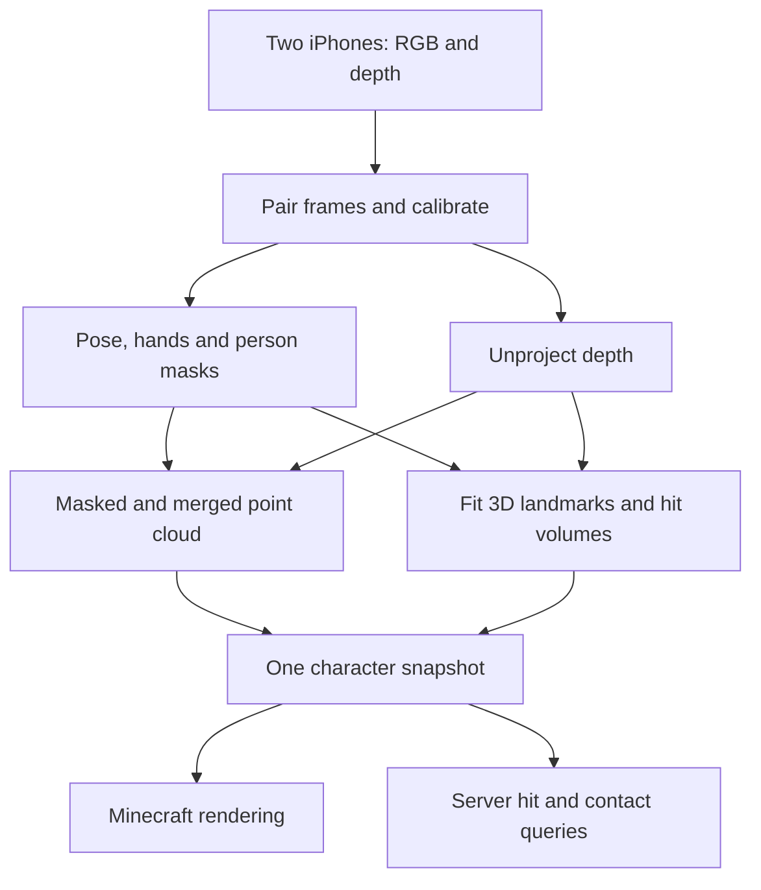

# Humans in Minecraft — MVP implementation brief

Prepared for Hack the North, September 19, 2026. This brief replaces the earlier, broader project plan.

## Product goal and pitch

Build a Minecraft Java Edition mod that places a captured real person in the world as a colored 3D point cloud. Give that person separate, correctly aligned hit volumes for their body, arms, hands, legs, and feet. The priority is believable geometry and accurate interaction locations, especially at the hands and feet.

Pitch: “Bring your actual body into Minecraft using two phones. Your appearance becomes 3D geometry, and the game knows where your hands, feet, and limbs are.”

Credit Dream's humans-in-Minecraft work as inspiration. Our proposed implementation uses iPhone RGB/depth capture, RGB landmark detection, and a Java mod. Do not present the general idea as a first-ever invention.

Reference: Dream's [I added humans to Minecraft…](https://www.youtube.com/watch?v=YHGMfQ1TDPA). Its identity and public description were checked on Dream's channel. Full playback/transcript could not be retrieved during preparation, so his camera setup, models, synchronization, and collision algorithms are **not verified here**. The implementation below is our proposed design, not a reconstruction of his private code.

## MVP boundary

Use one person, two fixed LiDAR-equipped iPhones, one processing laptop, and one Minecraft Java client with its integrated server.

The first acceptance demo is **capture, hold, inspect, and interact**:

1. The person stands in a marked capture area and holds a pose.
2. Capture a corresponding RGB/depth frame from each phone.
3. Reconstruct and isolate their colored surface, detect landmarks, and build hit volumes.
4. Display the resulting snapshot at a configurable Minecraft world anchor.
5. Aim at specific body parts and verify correct hit/miss results. Test hand/foot contact against a simple target cube.
6. Recapture at least three different poses and repeat.

A frozen snapshot is the first milestone, not the only input path. Keep capture streaming available for recapture and later slow live refresh. Do not spend the MVP budget on walking controls, jumping, locomotion, gesture commands, temporal prediction, or high-speed animation. Body pose can change between captures while the game anchor stays fixed.

Required: real RGB/depth capture, person-only point cloud, body and hand landmarks, separate hand and foot colliders, and actual hit/contact queries.

Deferred: full finger physics, grabbing players, standing on the captured person's hand, arbitrary terrain collision response, vanilla weapon/projectile compatibility, multiplayer distribution, photorealistic mesh reconstruction, and guaranteed 360-degree coverage. Two cameras still leave occluded surfaces. A missing measurement must remain unknown rather than becoming a fabricated body part.

## Architecture and four owners

The system maintains two related representations:

- **Appearance:** colored surface points from RGB + measured depth.
- **Interaction:** estimated anatomical landmarks and simple geometric hit volumes fitted to the person.

LiDAR does not directly label wrists, fingers, or toes. A pose detector does not directly produce a Minecraft collision system. Keep the two representations aligned through one frame identifier and one coordinate transform.

| Workflow | Owns | Main deliverable |
|---|---|---|
| 1 — iPhone capture | Swift app, RGB/depth acquisition, metadata, phone transport | Reproducible RGBD frames from both devices |
| 2 — Calibration and reconstruction | Python ingress, shared coordinates, frame pairing, foreground cloud, output assembly | Calibrated, person-only colored cloud |
| 3 — Landmarks and hit volumes | Pose/hand detection, segmentation mask, 3D joint fitting, collider fitting | Named 3D landmarks and confidence-aware colliders |
| 4 — Minecraft and integration | Java client rendering, integrated-server hit tests, debug controls | A human in Minecraft with working part-specific hits and contacts |

Proposed stack: native Swift/ARKit, Python with NumPy/OpenCV and MediaPipe Tasks, binary WebSockets, Minecraft Java with Fabric. Choose one supported Minecraft/Fabric/JDK combination and pin exact versions before coding. Use the documentation matching those versions; current Fabric examples may use different rendering APIs and mappings from older releases.

The lanes can develop against fixtures. Integration depends on a common contract, not on everyone finishing hardware work first.

## Shared contract — agree before implementing the lanes

**Coordinate system.** Use meters internally. Define a fixed stage frame with its origin on the floor at the capture mark, +Y upward, +X toward image-right as viewed by the designated front camera, and +Z toward that camera. Store transforms explicitly as `T_destination_from_source`. Matrices on the wire are row-major 4×4 arrays, applied to column vectors. Left/right landmark names mean the person's anatomical sides, never screen sides.

**Camera geometry.** Unproject in an optical frame: +X image-right, +Y image-down, +Z forward. Apply the calibrated `T_stage_from_optical` afterward. ARKit camera poses use a different camera-axis convention; convert it explicitly if using those poses. Never silently mix an ARKit transform with OpenCV optical coordinates.

**Minecraft mapping.** Use one configurable anchor, a documented axis mapping, and one uniform scale in blocks per meter. Start at 1 block/meter. Apply exactly the same mapping to points, keypoints, collider centers, endpoints, orientations, and sizes. Do not move each cloud to its own centroid. That would destroy two-view alignment and foot placement. A larger display scale magnifies measurement error too.

**Input must retain RGB.** Phones send RGBD packets, not only finished point clouds. Workflow 3 needs the RGB images to detect body and hand landmarks. Workflow 1 may display a local point-cloud preview, but Python owns the canonical reconstruction.

**Binary envelope.** Use a simple documented format, shared by Swift, Python, and Java:

| Field | Encoding |
|---|---|
| Magic | Four ASCII bytes: `HMC1` |
| Version | Little-endian unsigned 16-bit integer; initial value 1 |
| Message type | Little-endian unsigned 16-bit integer; 1 = RGBD, 2 = character snapshot |
| JSON header length | Little-endian unsigned 32-bit integer |
| Binary payload length | Little-endian unsigned 32-bit integer |
| Header | UTF-8 JSON containing metadata and buffer descriptors |
| Payload | Concatenated binary buffers; descriptors specify byte offsets and lengths |

Use WebSocket text messages for small controls such as hello, clock ping, capture request, acknowledgement, and errors. Validate lengths and maximum sizes before allocating. No base64 or JSON arrays for images, depth, or thousands of points.

Input header includes `device_id`, `session_id`, `sequence`, `capture_timestamp_s`, actual RGB/depth dimensions, RGB intrinsics at the transmitted RGB resolution, image orientation, tracking state, and buffer descriptors. Payload contains RGB JPEG, contiguous float32 depth in meters, and uint8 depth confidence when available. Preserve the captured ARKit camera pose as diagnostic metadata. Calibration state is managed by the backend.

The completed `CharacterFrame` contains:

- `session_id`, `calibration_id`, monotonically increasing `frame_id`, original source frame IDs, normalized capture time and pairing skew.
- `mode` (`snapshot` or `live`) and quality/validity summaries.
- Colored points: packed XYZ float32 plus RGBA uint8, 16 bytes per point.
- Named landmarks: position in stage meters, `valid`, observation source, and available confidence/visibility information. Use `null` for unavailable confidence; do not invent per-joint probabilities absent from the model.
- Colliders: stable ID, body-part label, type, geometry, validity, and the same frame/calibration IDs.

Collider schema supports `sphere(center, radius)`, `capsule(a, b, radius)`, and `obb(center, axes[3], half_extents)`. OBB axes must be orthonormal. An enclosing AABB may be cached for broad-phase rejection; it is not the final hit shape.

Canonical body names include `left/right_shoulder`, `left/right_elbow`, `left/right_wrist`, `left/right_hip`, `left/right_knee`, `left/right_ankle`, `left/right_heel`, and `left/right_foot_index`, plus explicitly derived `pelvis_center` and `head_center`. Keep all original pose landmarks available for debugging. Hand names are prefixed by `hand.left` or `hand.right`: `wrist`; thumb `cmc/mcp/ip/tip`; and index/middle/ring/pinky `mcp/pip/dip/tip`. Keep model-index mappings in the shared schema. Reconcile the hand-model wrist with the body-model wrist instead of treating them as unrelated attachment points.

Suggested backend interfaces:

- `/ws/capture`: device inputs and clock/control messages.
- `/ws/character`: processed snapshots and acknowledgements.
- `/health`: process/model/calibration status.
- `detect_view(rgb) -> mask, body_landmarks_2d, hands_2d, model_priors` — workflow 3.
- `reconstruct_view(rgbd, mask, calibration) -> colored_points_stage` — workflow 2.
- `fit_character(view_detections, rgbd_views, calibration, cloud) -> keypoints, colliders` — workflow 3.

Workflow 2 assembles and publishes the completed immutable snapshot. It must not pair a cloud from one capture with a skeleton from another. Workflow 4 uses that same snapshot for rendering and collision state.

Initial tunable settings: capture processing at 5–10 Hz for recapture, 20k–50k merged points, a 1–2 cm voxel size, and a pair-skew limit around 50 ms after clock-offset estimation. These are starting settings, not hardware performance guarantees. Preserve enough RGB resolution for hands; reduce the cloud before reducing away hand detail.

## Workflow 1 — Native iPhone RGBD capture

**Agent assignment:** implement the capture app and protocol sender. Deliver real sensor packets and a saved fixture; do not implement the game renderer or replace depth with a synthetic pose.

1. Check `ARWorldTrackingConfiguration.supportsFrameSemantics(.sceneDepth)` on each device. Both need supported depth hardware for the proposed two-depth-view pipeline. iPhone 13 Pro is suitable. Configure scene depth and read color and depth from the same `ARFrame`. Apple's [point-cloud sample](https://developer.apple.com/documentation/arkit/displaying-a-point-cloud-using-scene-depth) demonstrates the relevant acquisition path.
2. Acquire `capturedImage`, `sceneDepth.depthMap`, `sceneDepth.confidenceMap`, `camera.intrinsics`, `camera.imageResolution`, `camera.transform`, and `timestamp`. Skip frames with missing required depth. Begin with ordinary `sceneDepth`; compare smoothing later rather than assuming it improves moving boundaries.
3. Lock both phones in a known landscape orientation for the first build. Keep the transmitted raster unmirrored and avoid cropping. Record the exact relationship between transmitted RGB and depth rasters. A rotated UI preview must not silently rotate the data.
4. Convert the color buffer properly to RGB/JPEG. ARKit exposes full-range YCbCr; do not treat the buffer as packed RGB. Respect pixel-buffer row strides when copying depth and confidence. Resize RGB only if its intrinsics and image transform are updated correspondingly. See Apple's [captured image format](https://developer.apple.com/documentation/arkit/arframe/capturedimage).
5. Copy or retain frame buffers safely before returning from the capture callback. Encode and send off the capture/main thread with a bounded queue. If a send is still pending, replace an unsent old frame instead of building a backlog.
6. Provide device ID, backend address, connect, start, stop, and capture status. Request camera/local-network permissions as needed. Handle backgrounding and reconnect by starting a new session ID.
7. Respond to clock probes with receive/send timestamps from the same monotonic clock domain as frame timestamps. Do not substitute wall-clock time without a documented conversion.
8. Display RGB/depth preview, dimensions, valid-depth proportion, and connection state. A simple foreground preview can come later.

**Deliverables:** runnable Xcode project, device setup instructions, protocol encoder, and one saved real RGBD packet with its metadata. A Mac/Xcode and physical supported iPhones are hardware prerequisites for this gate.

**Acceptance:** Python decodes a real packet; colors/orientation are correct; depth units agree approximately with a measured stationary target; RGB edges and depth edges align; repeated captures do not leak buffers; reconnect does not mix sessions. A simulated fixture may unblock other lanes but does not pass the real-device gate.

## Workflow 2 — Calibration, pairing, and human point cloud

**Agent assignment:** own camera-to-stage geometry, receiving/recording frames, reconstruction, point-cloud fusion, and publishing the shared character snapshot. Use workflow 3's segmentation output instead of running a duplicate pose model.

1. Implement protocol validation, device sessions, bounded input queues, and a recorder/replayer. Save original RGBD frames and calibration so later defects can be reproduced without a person standing at the cameras.
2. Mount the phones at overlapping, oblique views first. Both must see the full body, including soles/feet and extended hands. Test framing with the actual person. Do not start with opposite cameras that cannot see a common calibration reference.
3. Use a printed ChArUco/ArUco board of measured size and known stage pose. Estimate each camera's pose with its RGB intrinsics and invert the object-to-camera transform to obtain camera-to-stage. If the board frame differs from stage, compose that known transform. [OpenCV calibration and reconstruction](https://docs.opencv.org/4.x/d9/d0c/group__calib3d.html) provides the underlying pose/triangulation operations.
4. Keep the board stationary while both cameras observe it; average/reject unstable estimates over several captures. Check positive depth, metric scale, reprojection error, and a separate known target. Save calibration with device/session IDs, raster configuration, transforms, and floor definition. Moving a tripod or changing the relevant capture geometry invalidates it. Opposite-view capture later needs a reference visible to both or a rigid multi-face target with known geometry.
5. Estimate clock offsets with several round trips and record uncertainty. With backend send/receive times `t0,t3` and phone receive/send times `t1,t2`, estimate phone-minus-backend offset as `((t1-t0)+(t2-t3))/2`; subtract it from phone capture time. Prefer low-round-trip samples and account for clock drift/session resets. This is approximate software alignment, not hardware synchronization. For the first capture, ask the subject to hold still and select a close pair. Reject pairs outside the configured skew/uncertainty budget.
6. Obtain a person mask from workflow 3. Use it with a fixed stage crop, plausible depth range, and confidence filtering. Start with one person in view. Avoid aggressive mask erosion that removes hands or toes. Do not fill absent depth with zero-distance points.
7. Unproject depth pixels using intrinsics for the depth raster. For matching, uncropped rasters, scale focal lengths and principal point from the RGB raster dimensions. Handle pixel-center conventions consistently. The optical point is `p = depth * inverse(K_depth) * [u, v, 1]`; depth is camera-plane Z distance, not a normalized-ray distance. Transform into stage coordinates and sample the matching RGB color. Apple's [ARDepthData reference](https://developer.apple.com/documentation/arkit/ardepthdata) describes the measurement.
8. Merge the two calibrated person clouds. Use spatial voxel downsampling and reject outliers; optionally weight overlapping colors by valid-depth confidence. Keep per-camera debug colors available so alignment mistakes are obvious. Do not force two unrelated surface sides together using unconstrained ICP on a moving body.
9. Pass per-view detections, depth, calibration, and local surface geometry to workflow 3. Assemble its returned keypoints/colliders with the matching cloud, then publish one immutable `CharacterFrame`.
10. Freeze a snapshot for inspection. On recapture, replace its geometry atomically. Repeated accumulation would create duplicated limbs and trails.

**Deliverables:** Python receiver, calibration utility, saved calibration, RGBD recorder/replayer, foreground-cloud preview, frame assembler, and character publisher.

**Acceptance:** a known marker appears at the correct scale and stage location from both views; overlap does not create two torsos; floor/background are excluded without deleting feet; a reflected/mirrored axis is caught by a labeled left/right test; replay produces the same geometry within declared numeric tolerances. Save an independent validation capture, not only the frames used to fit calibration.

## Workflow 3 — Body/hand landmarks and fitted hit volumes

**Agent assignment:** provide person masks, landmarks, 3D fitting, and collider construction. Prioritize spatial correctness over frame rate. Render debugging overlays before attempting game interaction.

### Detection and 3D registration

1. Use MediaPipe Pose Landmarker with one person and segmentation output enabled as the starting implementation. It provides 33 estimated body landmarks, including shoulders, elbows, wrists, hips, knees, ankles, heels, and a forefoot landmark on each foot. It does not provide a full toe skeleton. See the [Pose Landmarker guide](https://ai.google.dev/edge/mediapipe/solutions/vision/pose_landmarker).
2. Add MediaPipe Hand Landmarker for both hands. It provides 21 landmarks per detected hand. Retain sufficiently detailed RGB and, when useful, run it on padded hand regions identified from pose. Map crop/resize/rotation coordinates back to the transmitted camera raster. A larger crop does not create detail absent from the original image. See the [Hand Landmarker guide](https://ai.google.dev/edge/mediapipe/solutions/vision/hand_landmarker).
3. Associate each hand with the correct anatomical wrist using location, handedness, and consistency. Check this with an asymmetric pose such as right arm raised. Do not swap labels because the camera sees the back of the person.
4. Use calibrated views and depth to register landmarks into stage meters. For a visible image landmark, inspect a small masked neighborhood of valid depth values, reject background/depth discontinuities, and use a robust estimate. Avoid sampling one low-resolution pixel at a fingertip or floor boundary.
5. Where both views see the same anatomical landmark reliably, triangulate with calibrated cameras and reject poor ray geometry or large reprojection residuals. This gives a second constraint rather than blindly averaging inconsistent camera estimates.
6. Treat model-provided 3D coordinates as an anatomical prior that needs registration. Pose world coordinates are centered at the hips; hand world coordinates are centered at the hand. They are not already the shared stage frame. Fit rotation/translation and, where justified, a constrained scale against reliable observations; use robust residuals and anatomical length checks. [Pose output coordinates](https://ai.google.dev/edge/mediapipe/solutions/vision/pose_landmarker/python) and [hand output coordinates](https://ai.google.dev/edge/mediapipe/solutions/vision/hand_landmarker/python) document these origins.
7. Distinguish surface points from joint centers. LiDAR sees skin/clothing, not internal shoulder/elbow/wrist centers. Directly placing every joint on the visible surface can shift an entire hitbox outward. Use multiview observations, registered anatomical priors, and local surface fitting to choose collider geometry; inspect and measure the result.
8. Keep observation provenance and validity. Missing or conflicting landmarks must not become `(0,0,0)` joints. A low-confidence or occluded hand should disable or flag its fine collider, not generate an invisible hittable limb somewhere else. Invalidity must be explicit in the demo and quality report.

### Collider construction

Use a small collection of named analytic volumes; point density should not dictate collision cost.

| Region | Starting geometry | How to place/size it |
|---|---|---|
| Head | Sphere | Fit local head surface and registered head landmarks |
| Torso/pelvis | Oriented boxes or capsules | Shoulder/hip frame plus person-specific surface bounds |
| Upper arms | Capsules | Shoulder–elbow segments, fitted radius |
| Forearms | Capsules | Elbow–wrist segments, fitted radius |
| Hands | Oriented hand volumes | Wrist, MCP/palm landmarks, finger extent, and nearby valid surface |
| Thighs | Capsules | Hip–knee segments, fitted radius |
| Shins | Capsules | Knee–ankle segments, fitted radius |
| Feet | Separate oriented boxes or capsules | Heel-to-forefoot direction, ankle, measured width/height, sole region |

The mandatory hand collider represents the whole hand's usable volume, not just a sphere at the wrist. Fit its orientation and extent to the current pose. A palm box with several finger-envelope capsules is a useful next refinement when a single box yields obvious false positives. Individual finger-joint physics and reliable collision between fingers are not MVP requirements; report that resolution honestly.

The foot collider must cover the heel, sole, and toe region. An ankle sphere is insufficient. Estimate the longitudinal direction from heel to forefoot, and obtain width/height from valid nearby surface or an explicit initial measurement. Use the calibrated floor as a consistency check for a planted foot, not as an unconditional rule that flattens a lifted foot.

Fit dimensions from the captured subject; use measured defaults only where observations are insufficient and label those defaults. Do not increase radii merely until every test ray hits. Empty space between the arms and torso must remain empty.

Concrete fitting starting points:

- For an arm/leg capsule, use the registered joint centers as endpoints. Associate nearby surface points with that limb using its image region, segment distance, and visibility. Estimate radius from robust radial distances; reject contamination from a neighboring limb or the torso. Freeze subject-specific dimensions from a good calibration pose when a later view is incomplete.
- For a hand box, use wrist-to-middle-MCP as a longitudinal direction and index-MCP-to-pinky-MCP as a transverse hint. Orthogonalize the latter, take their cross product for the third axis, and project valid hand landmarks/surface points into this basis to estimate bounds. Include finger extent; add only a documented small padding. Reject degenerate bases and clearly curved-hand cases that need the palm-plus-capsules refinement.
- For a foot box, use heel-to-forefoot as the longitudinal direction. Use observed foot surface/registered pose for roll and sole orientation. A floor-normal fallback is valid only for an explicitly planted foot. Fit or measure width and sole-to-top thickness rather than assigning the shin's radius.
- If two cameras give incompatible positions for a joint, use the better-supported estimate or mark it invalid. Do not average two inconsistent locations into an apparently confident joint floating between them.

**Deliverables:** per-camera RGB overlays, point-cloud/skeleton/volume overlay, stable landmark IDs, pure collider construction functions, quality flags, and sample poses usable by the Minecraft lane.

**Acceptance:** hands attach to their own wrists; elbows bend the arm collider into two segments; left/right labels remain correct; feet point in the observed direction; volumes align with the visible surface; occlusion produces invalidity instead of phantom hits. Test neutral stance, one bent arm with an open hand, and one lifted/turned foot. Use held poses initially.

## Workflow 4 — Minecraft rendering, hit tests, and integration

**Agent assignment:** implement actual Java Edition integration. A point cloud in a standalone viewer is a debugging milestone, not the delivered game experience.

### Rendering

1. Select and lock Minecraft, Fabric Loader, Fabric API, mappings, Gradle, and JDK versions. Create shared/common code plus client rendering code. Minecraft has a logical server even in singleplayer; authoritative hit/contact logic belongs there. See [Fabric networking](https://docs.fabricmc.net/develop/networking).
2. Start with a synthetic cloud and known collider fixture while the phones are being built. Receive processed frames asynchronously; publish immutable snapshots safely to the rendering thread. Never decode JPEGs, run inference, or block on sockets inside a render callback.
3. Batch points as GPU geometry, using small point sprites/quads or cubes. Do not spawn a world block or entity for each point. Upload new data only on snapshot changes. Render using the proper version-specific world/entity rendering hooks and normal world depth testing. See [Fabric world rendering](https://docs.fabricmc.net/develop/rendering/world).
4. Apply the common stage-to-Minecraft transform once. A configurable fixed anchor is sufficient. Add toggles for cloud, anatomical skeleton, wireframe colliders, source-camera coloring, and frame/calibration IDs.
5. Treat debug wireframes as a display of the collider objects used by hit tests, not independently constructed approximations. A filled bounding box in the renderer does not create a game hitbox.

### Authoritative interaction

6. Keep the local MVP simple: the client receives the full `CharacterFrame`, forwards only the small collider snapshot to the integrated server using a Fabric custom payload, and waits for an accepted frame-ID acknowledgement before displaying that snapshot as active. Validate counts, finite values, dimensions, calibration ID, and session ownership. Use the same active snapshot for cloud and collider overlays.
7. Retain the active snapshot server-side and apply queries against it. Do not let a generic large enclosing entity box count as a body hit. If an entity is used for bookkeeping, ensure the custom part-specific path determines the actual result.
8. Implement a small probe item/key action first. The server derives the player's eye position, look direction, and allowed reach; the client does not decide which body part was hit. Test the enclosing AABB, then intersect the surviving capsules/spheres/OBBs, returning the nearest valid positive hit. Compare with the Minecraft block raycast so the human cannot be hit through a nearer wall.
9. On a confirmed hit, return `body_part`, collider ID, snapshot ID, and hit location. Highlight that exact part and increment a hit counter or emit a visible game event. Include a clear miss result. This proves working interaction without implementing all vanilla attack/projectile hooks.
10. Add one full-cube contact target. On the server, test valid hand/foot volumes against that cube and change its indicator state. Use segment-to-box distance for capsule overlap and a proper oriented-box overlap test for OBBs; an enclosing AABB alone is insufficient. Full physical push-out, friction, walking on the human, and arbitrary block shapes are deferred.
11. Snapshot mode intentionally preserves a selected capture until recapture/clear. In live mode, expired observations disable interaction and show tracking loss. Do not leave stale live hitboxes silently active. Avoid interpolation until matching visual and server snapshots work correctly.

**Deliverables:** runnable mod, backend connection configuration, a repeatable demo world, probe and contact target, debug controls, and installation/start instructions. The demo must work with cloud logging unavailable.

**Acceptance:** a hand probe reports the correct hand; a foot probe reports the correct foot; a ray through a gap misses; a nearer wall blocks the hit; a turned foot's contact result matches its oriented shape; changing scale/anchor moves cloud and hit volumes together. A visible wireframe by itself does not pass.

## Build order and acceptance gates

| Gate | Required proof |
|---|---|
| 1. Common fixture | Swift/Python/Java agree on binary layout, axes, units, and one synthetic scene |
| 2. Real single camera | RGB, depth, mask, and reconstructed person align in a desktop viewer |
| 3. Single-camera anatomy | Body/hand landmarks and fitted hand/foot volumes align on held poses |
| 4. Minecraft snapshot | Real cloud renders with the same landmark/collider snapshot; probe hits work |
| 5. Two-camera geometry | Independent calibration validation and a merged cloud without double limbs |
| 6. Interaction validation | Correct hands/feet, empty-space misses, wall occlusion, and target-cube contact |
| 7. Engineering evidence | Local diagnostics and saved measurements show a real defect or bottleneck and its measured improvement |

Lanes should use fixtures while waiting for dependencies. A basic Minecraft renderer and analytic hit-query implementation can start at Gate 1. Do not leave all game integration until the phones are perfect.

### What “accurate” means

There are two different errors to measure: capture/landmark error relative to the actual person, and implementation error between the rendered snapshot and collision queries. Perfect agreement between a wrong skeleton and its own collider does not demonstrate physical accuracy.

Use held neutral, bent-arm/open-hand, and turned/lifted-foot poses. Annotate visible landmarks on validation RGB images and use independently measured visible targets or calibration references for metric checks where practical. Reprojection agreement alone is not proof of correct depth.

Starting quality goals, to be measured on the actual rig:

- Calibration reprojection residual around 2–3 RGB pixels or better on held-out target observations, at the recorded RGB resolution.
- Hand/foot location error on visible, measurable targets around 5 cm or better for the held-pose demo. Record median and worst cases, separate by body part. This is an acceptance target, not an iPhone specification or a promise of finger-level accuracy.
- No mirrored limbs, no mismatched snapshot IDs, and no interaction with invalid colliders.
- Analytic tests cover hits, misses, tangency, origins inside volumes, transformed/scaled shapes, empty gaps, and nearer-wall obstruction.
- A repeatable ten-minute demo without growing queues, progressive geometry drift, or stale live interactions.

If the rig cannot meet the physical accuracy target, report the measured error and failing body parts. Improve calibration, image framing, hand crops, or surface fitting before adding gameplay. Do not widen hitboxes to hide localization errors.

## Handoff requirements

Each workflow should provide its entry point, configuration, dependency versions, one reproducible fixture, known limitations, and completed/unverified acceptance gates. Keep the shared schema and coordinate conventions in one versioned location. Record any proposed contract change before another lane implements against it.

The finished MVP is a captured person inside Minecraft with inspectable, functioning body-part hit volumes. Hardware validation and physical accuracy claims must come from the actual rig. A mock recording or synthetic skeleton can demonstrate software plumbing, but cannot establish sensor accuracy.
